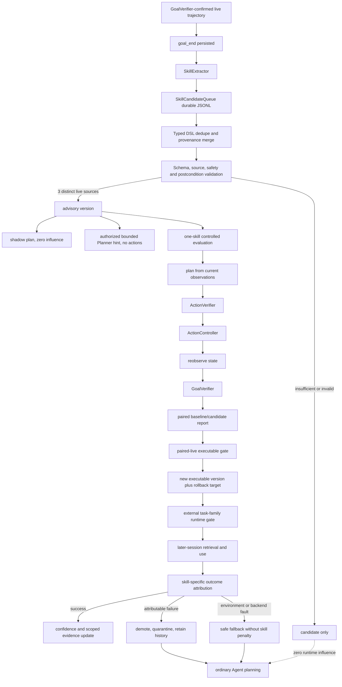

# Self-Learning Call Graph

Updated: 2026-07-10

Claim boundary: the bounded, evidence-gated skill-learning loop passed its defined final acceptance. This does not establish unrestricted continuous self-evolution.

## Capability Prerequisite

- `workspace/evals/self_learning_capability_evidence.json`: M1 is `repeat_verified` (5/5 benchmark tasks).
- The same report marks M3 `repeat_verified` from three distinct subsequent-use sessions plus an approved held-out transfer gate.
- Unit, mock, synthetic, and artifact-presence checks never grant runtime permission.

## Actual Runtime Path

## Component Audit

| Component | Status | Actual call path and live evidence |
|---|---|---|
| `SkillExtractor` | live verified | Manual three-source ingestion produced all three initial skills. Automatic post-episode extraction was live verified in session `9735e9d6-f9d`; `goal_end` precedes queue extraction and the source task is unaffected. |
| `SkillCandidateQueue` | live verified | Atomic JSONL persistence and lifecycle-wide normalized-template dedupe retain one canonical record across candidate/advisory/executable/quarantined states. Session `9735e9d6-f9d` extracted one candidate, merged it into `ef2c7be4`, created zero new records, and left 3/3 queue fingerprints unique. |
| `SkillPromotionCritic` | offline only, non-authoritative | It may review unknown semantics but cannot override schema, provenance, source-count, paired-live, or runtime gates. |
| `SkillLibrary` | live verified | Three advisory skills were promoted as new `1.0.1` executable versions. Success reinforcement, failure attribution, demotion, quarantine, history, and rollback metadata are persisted. |
| `custom_skills.jsonl` | live verified | Contains three version histories. Gather and crafting-table remain executable; wooden-pickaxe is quarantined after its successful loop and a later controlled failure series. |
| skill memory | live verified | Subsequent sessions select one executable skill and write one attributed outcome each. The M3 adapter recognizes these as bounded procedural retrieval/write evidence. |
| skill contract | live verified | `bounded_action_template_v1` supports only `acquire_block_drop` and `craft_item`. Python, JavaScript, Shell, eval, and code fields are rejected. Dynamic goal parameters bind effective postconditions. |
| task frontier skill router | partially integrated | The general frontier router remains broader project infrastructure. Learned-skill runtime selection itself is live verified and enforces task-family scope before contract ranking. |
| skill runtime default gate | live verified | Each runtime session required executable status, embedded paired-live evidence, and the matching external task-family gate. A missing restored gate caused a safe fallback and exposed a fixed isolation bug. |
| skill contribution report | live verified | Three paired reports contain fixed-control fingerprints, source log hashes, completion/safety metrics, and one-skill attribution. |
| skill retirement gate | live verified | Three controlled verifier-visible failures moved wooden-pickaxe from executable to advisory to quarantined. Automatic deletion is prohibited. |
| `benchmark --ingest` / `skill-candidates` | live verified | Three M1 logs per skill were ingested, deduplicated, validated, and promoted to advisory without influencing their source episodes. |
| Agent `goal_end` | live verified | Outcome attribution and exception-isolated candidate extraction run only after immutable `goal_end`; session `9735e9d6-f9d` proves the ordering and records dedupe outcome plus queue cardinality. |
| autonomous goal-end | partially integrated | Uses the same finalizer in code; no autonomous live acceptance claim is made by this work. |
| Planner injection | live verified | Shadow runs produced proposals with zero influence. Advisory runs injected coordinate-free action types and executed zero learned actions without completion regression. |
| controlled action sequence | live verified | Candidate/runtime actions pass ActionVerifier and ActionController, then reobserve state and run GoalVerifier. |
| outcome attribution | live verified | Action metadata identifies skill/version/phase/index/experiment. Runtime successes reached confidence 1.0; controlled failures reached 0.95 with first failed transitions. |
| demotion/quarantine | live verified | Sessions `d5a1d1fb-4df`, `85546580-71c`, and `a2560be6-b51` recorded three attributable failures and lifecycle states executable, advisory, quarantined. |
| held-out transfer | live verified | Gather 2 oak logs used a shifted, independently reset fixture and disjoint sessions. Baseline took 3 steps; runtime took 2 with completion 1.0. |
| M3 capability adapter | repeat verified | Runtime sessions `b9e1bb0e-88b`, `4b6f10e7-6fc`, and `1ec21c1f-fd9` plus the approved transfer gate satisfy 3/3. |

## Current Boundary

- Final bounded-loop acceptance: passed.
- `learned:gather_wood@1.0.1`: executable and held-out validated.
- `learned:craft_crafting_table@1.0.1`: executable.
- `learned:craft_wooden_pickaxe@1.0.1`: quarantined after first completing promotion and subsequent-use validation.
- Any corrected wooden-pickaxe implementation must become a new version and repeat baseline/candidate validation before executable use.
- The project still must not claim unrestricted continuous self-evolution or transfer beyond the recorded task families and held-out state split.
